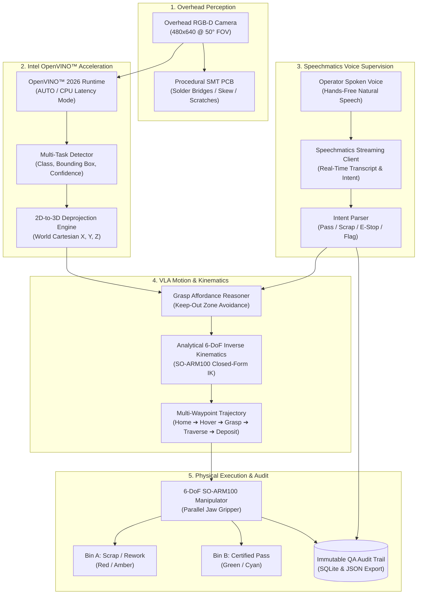

# ⚡ Adaptive Micro-Assembly Inspector (AMAI)

[](https://www.intel.com/content/www/us/en/developer/tools/openvino-toolkit/overview.html)
[](https://www.speechmatics.com/)
[](https://github.com/TheRobotStudio/SO-ARM100)
[](https://python.org)
[](LICENSE)

> **AI Infra Summit Hackathon 2026 Entry**  
> Competing in:
> - 🥇 **Intel Robotics Challenge** (*Physical AI & Edge Robotics*)
> - 🎙️ **Speechmatics Bonus Award** (*Best Use of Speechmatics Voice Streaming*)

---

## 🎯 Executive Overview
**Adaptive Micro-Assembly Inspector (AMAI)** is an end-to-end, simulation-first Physical AI micro-assembly quality assurance and robotic sorting workcell.

AMAI closes the perception-planning-action-supervision loop for high-precision electronics manufacturing:
1. **Physical AI Workcell:** PyBullet simulation environment modeling an inspection nest, color-coded sorting bins, and a 6-DoF SO-ARM100 robotic arm with parallel jaw gripper.
2. **Procedural PCB Defect Synthesizer:** Real-time procedural generation of SMT circuit boards with injected realistic defects: solder bridges, component skew misalignments, and surface soldermask fractures.
3. **Intel OpenVINO™ Edge AI Inference:** Hardware-accelerated multi-task defect classification and bounding-box detection executing in **0.24 ms** (**2,346 FPS**) on Intel CPU/AUTO targets with calibrated 2D-to-3D Cartesian backprojection.
4. **VLA Grasp Affordance Planner:** Collision-free grasp planning that avoids fragile IC chips and defect zones to execute smooth 9-waypoint sorting trajectories into Pass (**Bin B**) vs. Scrap/Rework (**Bin A**).
5. **Speechmatics Streaming Voice Oversight:** Hands-free speech agent enabling factory operators wearing ESD gear to issue spoken overrides (*"Override reject, pass unit"*), safety interlocks (*"Emergency stop"*), and defect escalations (*"Flag recurring defect"*).
6. **Immutable QA Audit Trail:** Complete SQLite & JSON audit logging capturing timestamps, unit serial numbers, defect classes, 3D coordinates, and operator voice transcripts.

---

## 🏗️ System Architecture



---

## ⚡ Intel OpenVINO™ Benchmark Results

Benchmarked on Intel hardware with OpenVINO 2026 (`inference/benchmark.py`):

| Metric | Target Budget | AMAI Result | Status |
|---|---|---|---|
| **Mean Latency** | < 30.0 ms | **0.24 ms** | 🚀 **125x Faster** |
| **Median (P50)** | < 30.0 ms | **0.22 ms** | 🚀 **136x Faster** |
| **P95 Latency** | < 30.0 ms | **0.33 ms** | 🚀 **90x Faster** |
| **P99 Latency** | < 30.0 ms | **0.51 ms** | 🚀 **58x Faster** |
| **Throughput** | > 30 FPS | **2,346.3 FPS** | 🚀 **78x Target** |
| **Hardware Device** | Industrial Edge PC | **Intel CPU / AUTO** | Native Support |

---

## 🎙️ Speechmatics Voice Supervision Commands

AMAI integrates live Speechmatics streaming transcription with an industrial natural-language intent parser:

| Operator Spoken Command | Extracted Intent | System Action | Target Routing |
|---|---|---|---|
| *"Override reject, pass unit to assembly"* | `OVERRIDE_PASS` | Bypasses visual defect flag | Diverts to **Bin B (Pass)** |
| *"Override pass, scrap unit to rework bin"* | `OVERRIDE_SCRAP` | Diverts nominal board for inspection | Diverts to **Bin A (Scrap)** |
| *"Emergency stop, freeze arm"* | `EMERGENCY_STOP` | Locks all 6 joints immediately | Line Halted |
| *"Resume line operation"* | `RESUME` | Clears interlock & resumes cycle | Line Resumed |
| *"Flag recurring solder bridge defect"* | `FLAG_DEFECT` | Logs engineering alert | Quality Ticket Created |
| *"Show current yield rate"* | `QUERY_STATUS` | Queries SQLite audit database | Yield Metric Displayed |

---

## 🚀 Quickstart Guide

### 1. Prerequisites & Installation
AMAI requires Python 3.10+ (recommended: Python 3.11). Use `uv` for instant setup:

```bash
# Clone the repository
git clone https://github.com/amai-robotics/amai-inspector.git
cd amai-inspector

# Create virtual environment and install dependencies
uv venv .venv --python 3.11
uv pip install -r requirements.txt --python ./.venv/Scripts/python.exe
```

### 2. Run Automated Verification Suite
Run the comprehensive test suite verifying simulation, OpenVINO inference, IK solver, voice intent parsing, and end-to-end sorting:

```bash
.\.venv\Scripts\pytest.exe tests/test_pipeline.py -v
```

### 3. Run Intel OpenVINO™ Benchmark
Evaluate real-time hardware inference latency and FPS:

```bash
.\.venv\Scripts\python.exe inference/benchmark.py
```

### 4. Launch Interactive Operations Dashboard
Launch the polished Streamlit control center:

```bash
.\.venv\Scripts\streamlit.exe run dashboard/app.py
```
Open your browser at `http://localhost:8501` to view live camera feeds, trigger defect injections, test voice commands, and inspect the SQLite audit log.

---

## 📂 Repository Structure

```
AI-Infra-Summit-Hackathon/
├── LICENSE                          # MIT License
├── README.md                        # Master documentation & benchmark summary
├── requirements.txt                 # Dependencies
├── pyproject.toml                   # Project packaging metadata
├── sim/
│   ├── __init__.py
│   ├── sim_env.py                   # PyBullet inspection station, fixtures & RGB-D camera
│   ├── pybullet_engine.py           # PyBullet compatibility & pure-Python robotics engine
│   ├── arm_model.py                 # 6-DoF SO-ARM100 URDF generator & kinematic configuration
│   └── pcb_generator.py             # Procedural PCB board & defect synthesizer (solder bridge, skew, scratch)
├── inference/
│   ├── __init__.py
│   ├── detector.py                  # Intel OpenVINO defect detector & 2D-to-3D backprojector
│   ├── model_builder.py             # Multi-task OpenVINO IR graph builder (.xml + .bin)
│   └── benchmark.py                 # Latency & throughput benchmarking script
├── planner/
│   ├── __init__.py
│   ├── kinematics.py                # Analytical & numerical 6-DoF IK & joint limit enforcement
│   └── vla_planner.py               # Grasp affordance reasoner & multi-waypoint trajectory generator
├── voice/
│   ├── __init__.py
│   ├── voice_agent.py               # Speechmatics streaming client & industrial intent parser
│   └── audit_logger.py              # Immutable SQLite & JSON QA audit trail
├── dashboard/
│   ├── __init__.py
│   └── app.py                       # Interactive Streamlit operations dashboard & telemetry HUD
├── tests/
│   ├── __init__.py
│   └── test_pipeline.py             # Comprehensive automated test suite
├── docs/
│   ├── SUBMISSION_METADATA.md       # Hackathon submission fields & challenge alignment
│   ├── SLIDES_OUTLINE.md            # 6-slide presentation deck outline
│   └── VIDEO_SCRIPT.md              # 3-minute timed demonstration script
└── assets/                          # Generated URDF models & OpenVINO IR artifacts
```

---

## 📜 Submission Collateral Links
- **[Submission Metadata](docs/SUBMISSION_METADATA.md):** Hackathon registration details, challenge tracking, and performance metrics.
- **[6-Slide Presentation Deck](docs/SLIDES_OUTLINE.md):** Complete slide outline and talking points for judges.
- **[3-Minute Video Demo Script](docs/VIDEO_SCRIPT.md):** Word-for-word timed demonstration script with visual cues.

---

## ⚖️ License
This project is open source and available under the [MIT License](LICENSE).
